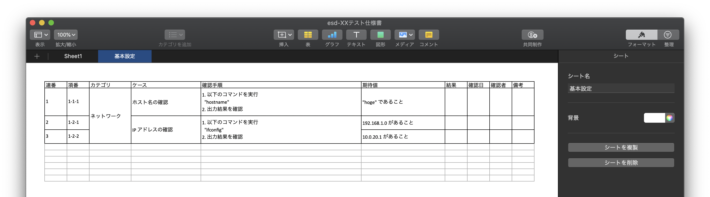

# go-esd
## Excel Specifications are Dead.

このツールのテーマはこれ


## What Is ?

Markdown で記述したテスト仕様書を Excel にそれっぽく変換するコマンドラインツール


## 使い方

以下のようなMarkdown で記述したテスト仕様書を作成


---

# XXテスト仕様書

## 基本設定

### ネットワーク

#### ホスト名の確認

1. 以下のコマンドを実行

    "hostname"

1. 出力結果を確認

- [ ] "hoge" であること


#### IP アドレスの確認

1. 以下のコマンドを実行

   "ifconfig"

2. 出力結果を確認

- [ ] 192.168.1.0 があること
- [ ] 10.0.20.1 があること

> 引用はコメント扱い

---


これを `test.md` とした場合、以下のように実行

```bash
$ ./esd --mdfile test.md  --dest .
esd-XXテスト仕様書.xlsx
```

生成された `esd-XXテスト仕様書.xlsx` を開くと以下のような構造になっている




## 詳細

### Markdown の構造

| プレフィックス | 意味     | Excel での表現                           |
| -------------- | -------- | ---------------------------------------- |
| `# `           | ファイル | 生成されるファイル名 (`esd-<hoge>.xlsx`) |
| `## `          | ジャンル | シート名                                 |
| `### `         | カテゴリ | カテゴリ                                 |
| `#### `        | ケース   | ケース                                   |
| `1. `          | ステップ | 確認手順                                 |
| `- [ ] `       | チェック | 期待値                                   |
| `> `           | コメント | 反映されない                             |


### コマンドオプション

| オプション (full) | オプション (short) | 意味                                                        |
| ----------------- | ------------------ | ----------------------------------------------------------- |
| --file            | -f                 | **[必須]** Markdown ファイルのパス                          |
| --dest            | -d                 | 出力先ディレクトリのパス<br />default: カレントディレクトリ |
| --version         | None               | バージョンを表示                                            |
| --help            | None               | ヘルプを表示                                                |

